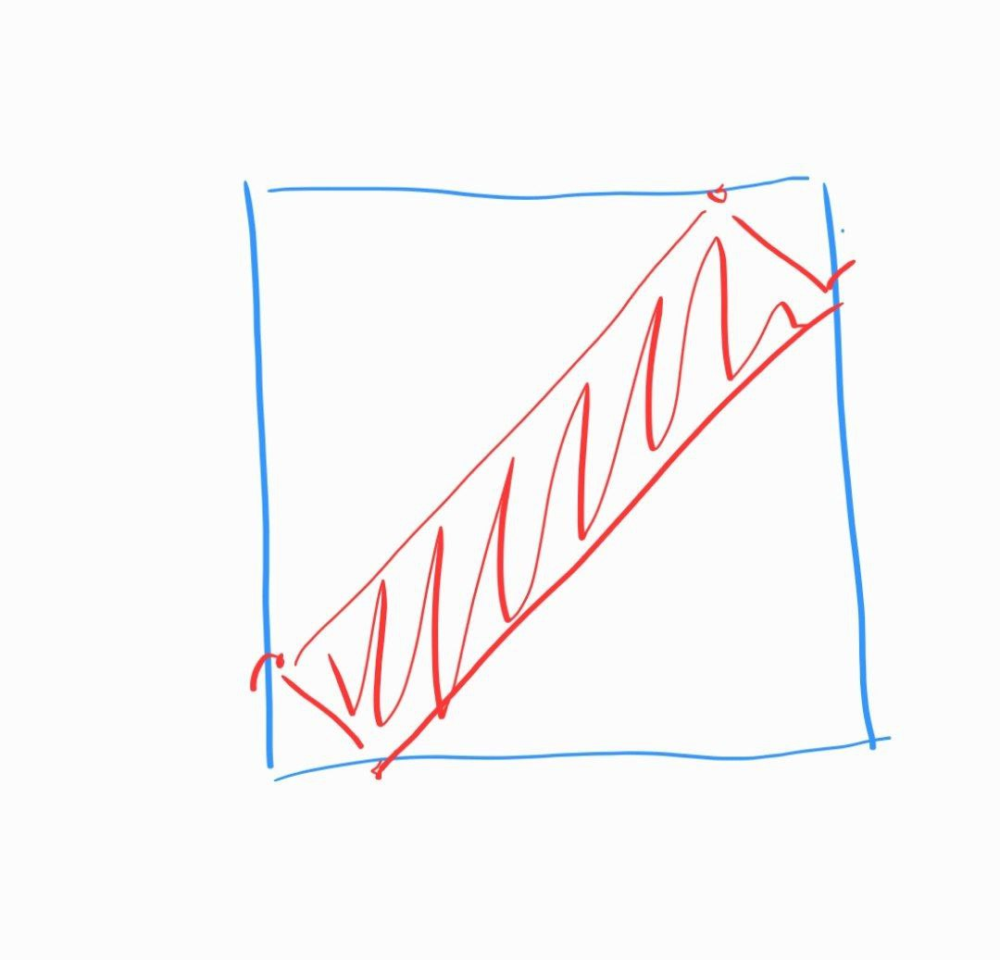

# Graph Recognizer

## Данные
https://disk.yandex.ru/d/9Bvedhtg6aGyCQ
 
___

## Постановка задачи

Требуется по пришедшему на вход изображению планарного графа распознать его список смежности, результатом являются:
- список смежности графа с изображения на входе
- изображение графа, восстановленное по полученному списку смежности

___

### Объект распознавания
Планарный граф

### Свойства распознаваемого объекта
- Граф планарный, связный, невзвешенный (меток весов нет)
- Граф должен полностью помещаться на изображении (должен присутствовать зазор не менее 5 пикселей между границами изображения и границами примитивов графа)
- Вершина - примитив (окружность) с текстом метки внутри
- Цвет примитива вершины - черный
- Фон примитива вершины совпадает с фоном изображения
- Шрифт текста метки Arial, не курсив, допустимые символы: A-Z
- Метка всегда состоит из 2 символов из списка допустимых
- Баундбокс метки полностью помещается внутри примитива вершины, кратчайшее расстояние от границы баундобкса до границы примитива вершины не менее 5 пикселей
- Цвет метки
> Один из двух вариантов будет выбран в дальнейшем в зависимости от выбранного способа решения:
> 1. Черный
> 2. Красный
- Ребра могут быть двух видов
> Один из двух вариантов будет выбран в дальнейшем в зависимости от выбранного способа решения:
> 1. Одна или две параллельные сплошные прямые
> 2. Одна сплошная прямая двух различных цветов (синий/зеленый)
- Ребра не пересекаются
- Прямая, соответствующая ребру, соединяющему две вершины, доходит до границ примитивов этих вершин, но не пересекает их (зазора быть не должно)

______

### Входные данные:
- Путь до файла с изображением графа
- Путь для выгрузки изображения восстановленного по списку смежности графа

### Требования к изображению на входе:
- На изображении присутствует только один граф, посторонних объектов быть не должно
- Разрешение не менее 300x400
- Формат .png
- Объект на изображении резкий, не смазанный
- Цвет фона - белый
- Объект должен быть хорошо различим на фоне
- Отсутствие теней
- Ребра и вершины должны быть различимы, метки читаемы

### Допустимые искажения:
- Зашумление изображения

___

### Выходные данные
- Список смежности распознанного графа (стандартный вывод)
> dict[str: dict[str: dict[str: str]]] - словарь, в котором ключ является строковой меткой вершины, а значение – словарём, состоящим из пар (метка смежной вершины, словарь со значенями веса и типа ребра).
- Изображение восстановленного по списку смежности графа (сохранить по указанному пути или, если путь не был указан, вывести в отдельное окно)

### Ограничения
- Для корректного вывода значение параметра веса ребра принимается за 1

  
  
  
___
## План реализации
1. Сбор данных для нейросети
   - Генерация путей и вершин из данных OSM для автомобильных дорог нескольких районов СПб и Москвы с помощью враппера для Python – osmapi
   - Так как граф даже для района будет скорее всего иметь слишком много вершин, то далее будут браться некоторые случайные окрестности сгенерированных на прошлом этапе графов
   - Далее для каждого саб-графа:
     - На этом этапе меткой вершины является ее идентификатор, пришедший из OSM. Каждому идентификатору будет сопоставляться случайным образом сгенерированная метка (из постановки: 2 символа из списка разрешенных A-Z) с условием уникальности каждой метки внутри одного саб-графа. 
     - На этом этапе ребра объединены в пути. Составляется список смежности в формате dict[str: dict[str: dict[str: str]]] (в нем содержится информация о метке вершины, смежных с ней вершинах, весе и типе соединяющего их ребра). Вершины уже будут обозначены сгенерированными метками из п. ii, для ребер в процессе записи случайным образом будет выбираться тип (из постановки: 1 или 2 параллельные прямые)
     - В соответствии с требованием связности графа проводится поиск компонент связности графа и, если их больше чем 1, остается только одна с наибольшим количеством вершин (если такая не одна, тогда выбирается компонента, вершина которой первой засветилась в списке смежности)
     - Для каждого полученного списка смежности с помощью graphviz будет отрисовываться изображение графа в формате .png и параллельно производиться запись списка смежности в формате из постановки задачи с помощью pickle. Названия файлов с изображением графа и его списком смежности будут иметь идентичные названия <номер_графа>_img.png и <номер_графа>_adj.pickle 
     - Дополнительно для каждой вершины имеются ее координаты из исходного графа «с карты», чтобы удовлетворить требованию непересечения ребер на изображении графа (аргумент pos позволяет это сделать) они будут нормироваться на размер изображения и далее использованы в генерации баундбоксов для обучения нейросети
     - Для обучения понадобятся баундбоксы вершин/ребер с метками, поэтому по вернувшимся данным от graphviz они также будут записываться в файл с названием <номер_графа>_teacher.pickle (label – координаты 4 углов баундбокса)
   - Таким образом полагается сгенерировать порядка 10 000 изображений графов и соответствующих им списков смежности
2.	На полученных данных (изображения графов + координаты баундбоксов с метками) будет дообучаться нейронная сеть Faster R-CNN, от нее нужно получить распознанные баундбоксы вершин и ребер двух типов (то есть требуем баундбоксы с метками: node, type 1 edge, type 2 edge)
3.	С помощью opencv производится распознавание меток вершин внутри областей баундбоксов распознанных вершин.
4.	Составление списка смежности распознанного графа:
    - На вход приходят: баундбоксы + метки, которые смогла распознать нейронка
    - Для каждого распознанного ребра существует ровно 2 вершины, которые оно соединяет, их и будем искать. Также известно, что выбранная на текущем этапе нейросеть рисует баундбоксы с вертикальными и горизонтальными гранями. Для каждого баундбокса с меткой ребра находим диагональ, на которой большее скопление черных пикселей (отступим от каждого угла вдоль смежных с ним сторон на X% от минимума длин сторон баундбокса и соединим точки отступов на смежных сторонах, так образуется полоса а-ля маленький баундбокс внутри большого, внутри которого и будет производиться подсчет. Значение X будет подбираться на практике) - предположим, что по этой диагонали и направлено найденное ребро. Далее для каждого угла, которые соединяет выбранная диагональ, находим вершину, центр баундбокса которой находится ближе всего к этому углу. Таким образом найдем 2 вершины и примем, что это ребро соединяет их.   
Для понимания:   
    - Составляется список смежности в формате из постановки из распознанных данных
5.	Для распознанного списка смежности отрисовывается изображение графа для проверки (с учетом позиций баундбоксов распознанных вершин), чтобы сохранить топологию исходного графа. 
6.	Изображение восстановленного по распознаному списку смежности графа сохраняется по указанному в аргументах пути, иначе выводится в отдельное окно. Список смежности выводится в стандартный вывод.
______________________________________________________________________________
Если нейросеть не будет вывозить bare minimum по распознаванию вершин и ребер графа, есть возможность использовать детерминированные алгоритмы вместо нейросети.  
  
Отличия:
1.	При генерации данных 
    - Типы ребер: (1 параллельная прямая, 2 параллельные прямые)  (1 синяя прямая, 1 зеленая прямая)
    - Цвет метки вершины: Черный --> Красный
2.	Распознавание баундбоксов:
    - Нейросеть --> Детерминированный алгоритм распознавания вершин/ребер по цветовой маске
3.	Детерминированный алгоритм распознавания вершин/ребер:
    - По цветовым маскам (red, green, blue) можно будет выделить на изображении по-отдельности все вершины/ребра типа 1/ребра типа 2
    - Выделение компонент связности на изображении и для каждой находится баундбокс, в соответствии с выбранной цветовой маской баундбоксу присваивается метка
4.	После п.2 основного плана дальнейший алгоритм не изменяется

